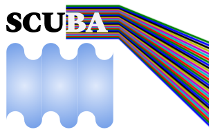
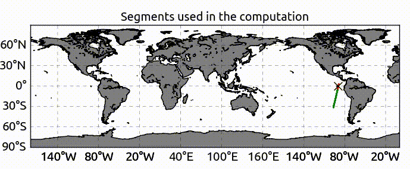
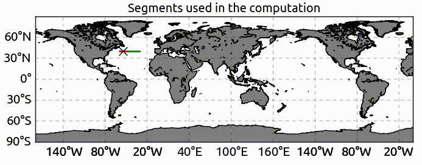
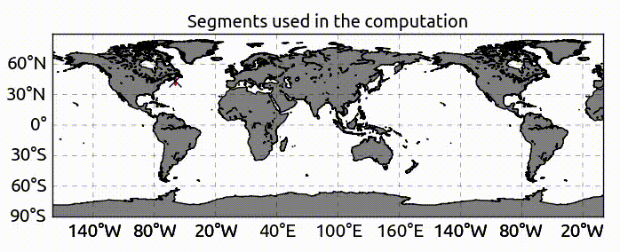
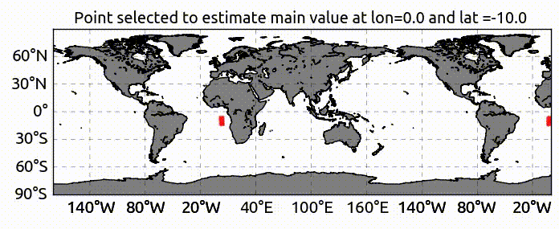
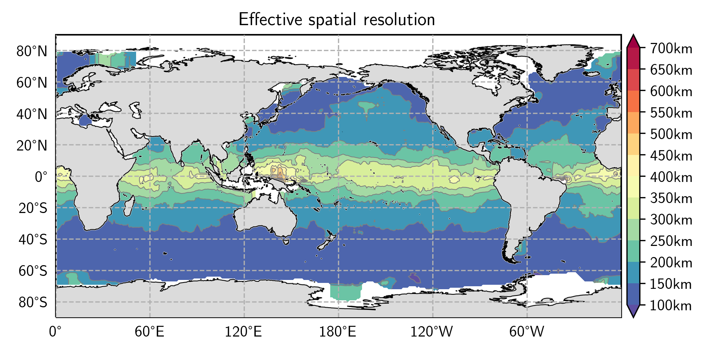
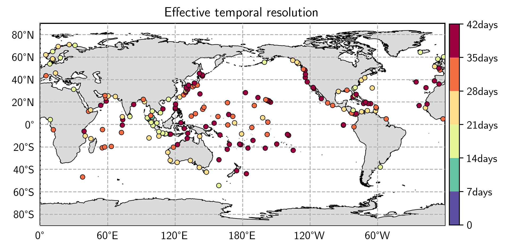
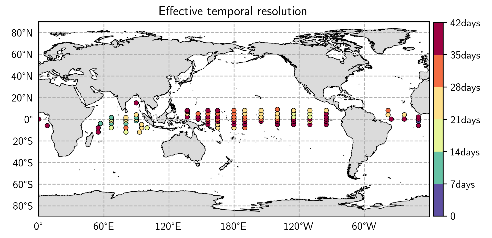
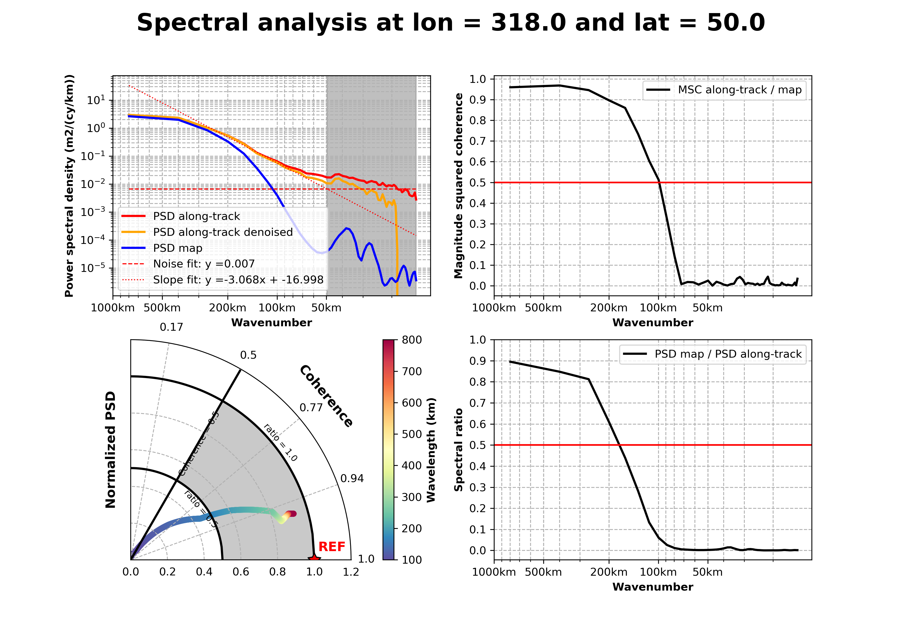

SCUBA performs spectral/statistical analysis of along-track and gridded dataset, as well as spectral statistical comparison between two fields (e.g., along-track vs grid, grid vs grid).

# Table of contents
<!--ts-->
   * [Table of contents](#table-of-contents)
   * [Structure of SCUBA](#structure-of-scuba)
   * [Usage and Background ](#usage-and-background)
   * [First step with SCUBA](#first-step-with-scuba)
      * [Running test cases](#running-test-cases)
      * [Visualisation of the results](#visualisation-of-the-results)
   * [Authors and Contributors](#authors-and-contributors)


# Structure of SCUBA
```
                                        SCUBA
                                          |
            +--------------------+----------------+---------------------+
          share                 src           test_case                tools
```
* `share` contains information or files for running the program, e.g. the distance from closest land point (needed for coastal editing) or altimeter mission information
* `src` contains the python scripts to perform the analysis
* `test_case` provides test cases to test the program
* `tools` includes scripts to display spectrum, resolution and spectral Taylor Diagram 


# Usage and Background
* `scuba_alongtrack.py` performs spectral analysis on along-track data or between along-track and gridded data
* `scuba_grid.py` performs spectral analysis on gridded data or between two gridded data
* `scuba_tide_gauge.py` performs spectral analysis on tide gauge and gridded data timeseries
* `scuba_mooring.py` performs spectral analysis on mooring and gridded data timeseries

The program is structured as follow:
* 1- reading the dataset

* 2- computing segment (along-track, or zonal or meridional) database

<p align="center">
<b>Example alongtrack direction</b>
</p>



<p align="center">
<b>Example zonal direction</b>
</p>



<p align="center">
<b>Example meridional direction</b>
</p>



* 3- performing spectral analysis in boxes by selecting all the segments of the database found within the box




* 4- gridding the results

* 5- writing netCDF output


# First step with SCUBA
## Running test cases
---
     >> cd test_case/
     >> ./run_example.x


This test cases performs spectral analysis on altimeter maps and along-track data. For more detail on the analysis parameters see *.yaml parameter files.

## Goodies & Visualisation of the results
---
     >> cd tools
The `tools` folder contains several scripts for additional diagnostics (autocorrelation, resolution, ...): 
* `compute_autocorrelation_alongtrack.py` computes autocorrelation functions from along-track analysis
* `compute_autocorrelation_tg_mooring.py` computes autocorrelation functions from tide-gauges or mooring analysis
* `compute_effective_resolution_alongtrack.py` computes map effective spatial resolution from along-track/map analysis
* `compute_effective_resolution_tg_mooring.py` computes map effective temporal resolution from tide-gauges or mooring analysis
* `compute_effective_resolution_transfer_function.py` computes filter transfer function 
* `compute_resolution_limit_alongtrack.py` computes along-track resolution as defioned in Dufau et al. (2016)
* `compute_skill_score.py` computes skill score (under dev)
* `compute_variance.py` computes variance
* `display_scuba_alongtrack.py` shows spectral analysis for along-track 
* `display_scuba_grid.py` shows spectral analysis for grids
* `plot_spatial_resolution.py`  shows spatial resolution
* `plot_temporal_resolution.py` shows temporal resolution    

Some examples below:

     >> cd test_case/
     >> python ../tools/compute_effective_resolution_alongtrack.py psd_alongtrack_direction.nc effective_resolution_alongtrack.nc
     >> python ../tools/plot_spatial_resolution.py effective_resolution_alongtrack.nc
     


     >> python ../tools/compute_effective_resolution_tg_mooring.py psd_tide_gauge.nc effective_resolution_tg.nc
     >> python ../tools/plot_temporal_resolution.py effective_resolution_tg.nc



     >> python ../tools/compute_effective_resolution_tg_mooring.py psd_mooring.nc effective_resolution_mooring.nc
     >> python ../tools/plot_temporal_resolution.py effective_resolution_mooring.nc



     >> python ../tools/display_scuba_alongtrack.py psd_alongtrack_direction.nc



# Authors and Contributors
* Maxime Ballarotta, Clément Ubelmann
* _Feel free to dive in ..._
